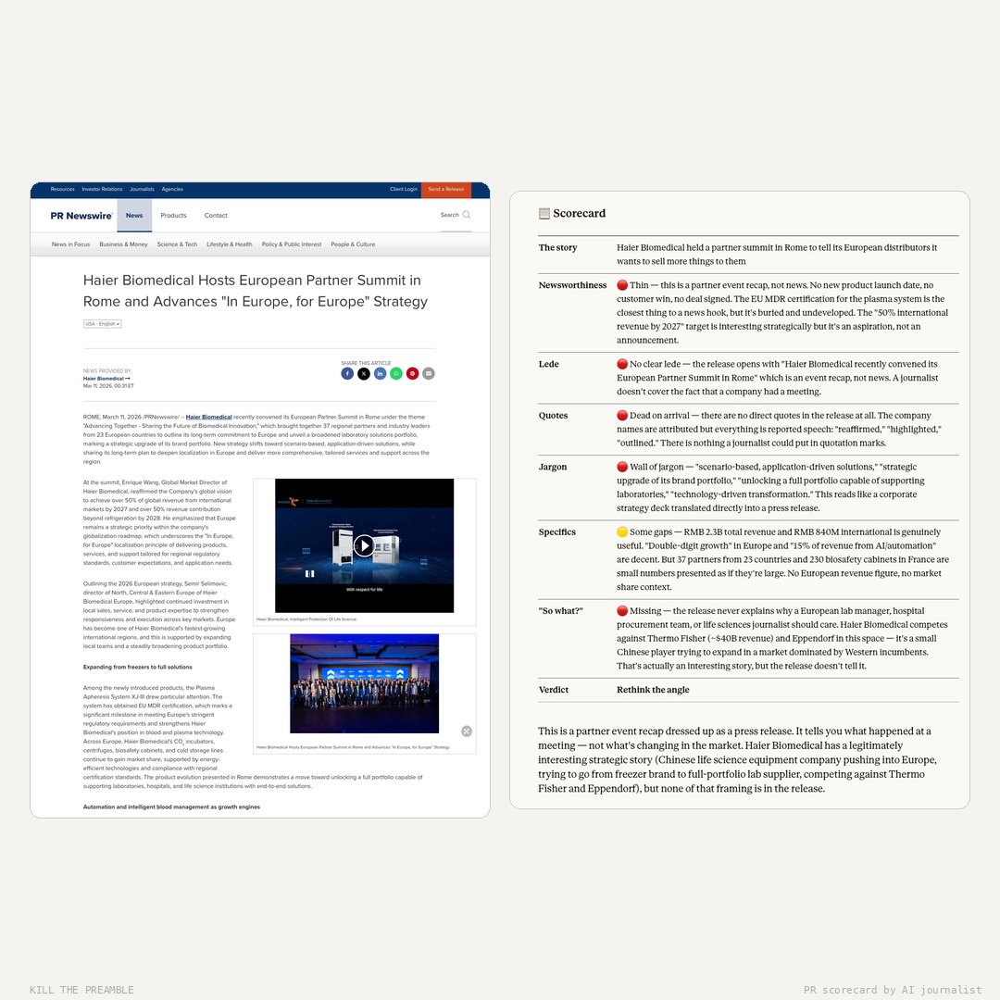

# Kill the Preamble

A Claude Code skill that analyzes press releases the way a journalist actually reads them. Paste a PR, get a brutal honest scorecard — then a rewrite that leads with the actual news.

Built by a journalist who's read thousands of press releases and knows exactly why most of them get ignored.



## What it does

**Kill the Preamble** scores press releases across seven dimensions, gives a verdict, and rewrites them as a journalist would. It's designed for PR teams who want to pressure-test before hitting send, and journalists who want to extract the story fast.

### The scorecard

Every press release gets scored on:

- **Newsworthiness** — Would a journalist on this beat open this email?
- **Lede** — Is the news in the first sentence, or buried in paragraph 6?
- **Quotes** — Would any quote survive an editor? Or is it all "We're thrilled to announce..."
- **Jargon** — How much corporate language needs to be stripped?
- **Specifics** — Numbers, dates, names? Or just adjectives?
- **"So what?"** — Does it explain why anyone outside the company should care?

Verdict: **Send it** / **Fix it first** / **Rethink the angle**

### The rewrite

A ~250-word journalist rewrite that leads with the news, kills the jargon, and ends with a "so what?" — the version a reporter could actually adapt into coverage.

### Research-backed

The skill uses web search before analyzing to look up the companies involved, check competitive context, verify claims, and assess timeliness. It doesn't just apply generic rules — it understands the landscape.

## Installation

### For Claude Code users

Clone this repo into your Claude Code skills directory:

```bash
git clone https://github.com/zwzw27/kill-the-preamble.git ~/.claude/skills/kill-the-preamble
```

Or copy the files manually:

```bash
mkdir -p ~/.claude/skills/kill-the-preamble/references
cp SKILL.md ~/.claude/skills/kill-the-preamble/
cp references/adtech-context.md ~/.claude/skills/kill-the-preamble/references/
```

### Using the .skill file

Download `kill-the-preamble.skill` from the [releases](../../releases) page and install it in Claude Code.

## Usage

Just paste a press release into Claude Code. The skill triggers automatically when it detects PR-style content — datelines, boilerplate, "FOR IMMEDIATE RELEASE", executive quotes, etc.

You can also trigger it explicitly:

```
/kill-the-preamble

> [paste your press release here]
```

Or just say things like:
- "What's the real story here?"
- "Rewrite this PR"
- "Is this newsworthy?"
- "Fix this press release"

## What makes this different

Most AI writing tools rewrite press releases into... slightly different press releases. This one thinks like a **journalist on the receiving end**:

- It checks timeliness — is the cited study from today or last year?
- It spots coordinated timing — did a third-party report drop the same day?
- It knows the difference between news and noise
- It gives PR teams actionable advice, not just criticism
- It includes a "disclosure ladder" for when legal won't let you share the data a journalist needs

## Industry context

Default lens is B2B technology, adtech, and martech — but the skill adapts to any industry via web search. The `references/` directory includes base knowledge for the adtech/programmatic space. Additional industry context files can be added over time.

## Architecture

| File | Purpose | Loaded when |
|---|---|---|
| `SKILL.md` | Core scoring framework, tone, format | Always (skill trigger) |
| `references/adtech-context.md` | Adtech/martech industry knowledge | Adtech/martech releases |

The skill uses progressive disclosure — `SKILL.md` is the core map, reference files load on demand. Web search fills in the rest.

## Philosophy

1. **Journalists are the audience.** Press releases exist to generate coverage. If a journalist wouldn't read it, it failed.
2. **Be honest, not mean.** The scorecard is direct but constructive. PR teams know they have to send releases — help them land better.
3. **Data beats adjectives.** The most common reason releases get ignored is vagueness. Numbers are the fix.
4. **Give credit when earned.** Good PR exists. The skill should recognise it, not reflexively tear everything apart.

## Contributing

Found a way to make the scorecard sharper? Have industry context for a vertical beyond adtech? PRs welcome.

## License

MIT — Use it, modify it, share it.

## Credits

Created by [Zac](https://github.com/zwzw27) with Claude.

Inspired by years of reading press releases that bury their own news.
